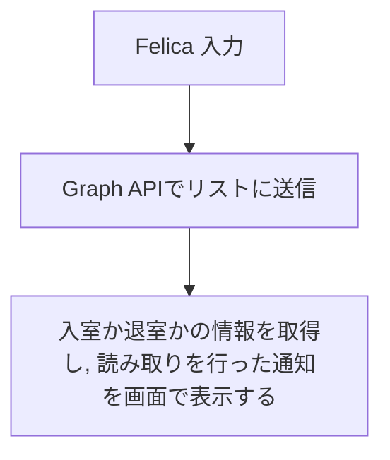
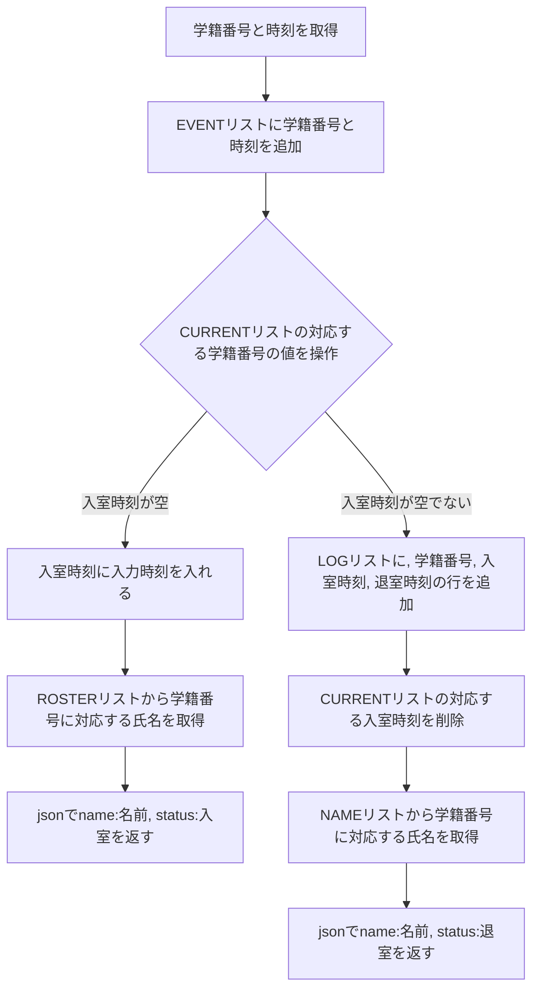
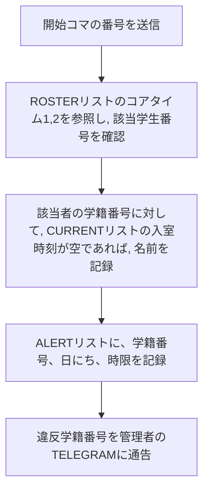
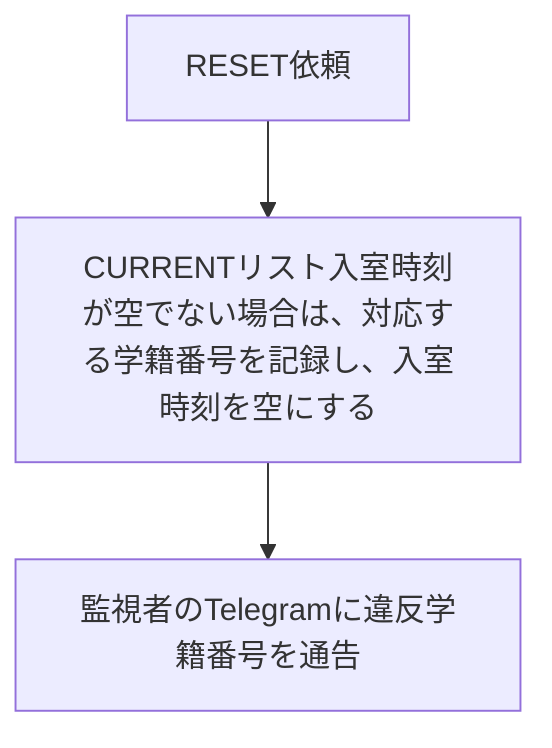

# AttendanceManager

## 概要
学生の実習室の入退室の状況を、管理する為のシステムです。
学生証をFelicaリーダーで読み込み、Sharepoint上のリストにデータを送信します。
リストを経由して、現在の利用状況や、最近の利用状況のレポートを作成します。

## flow
### 実習室での操作

### 実習室から利用するapi

### コアタイム監視api
授業の開始時刻に実習室のPCから出す。

### RESET用のapi
退室忘れの場合は入室を無効かします。
毎日0時に実習室のPCからリクエスト

