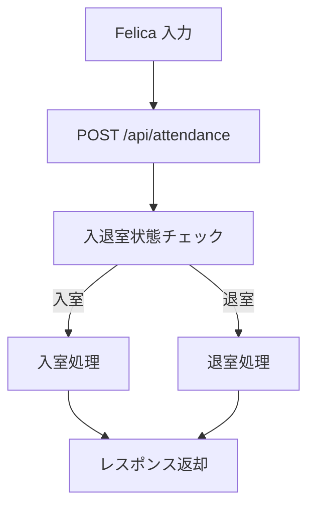
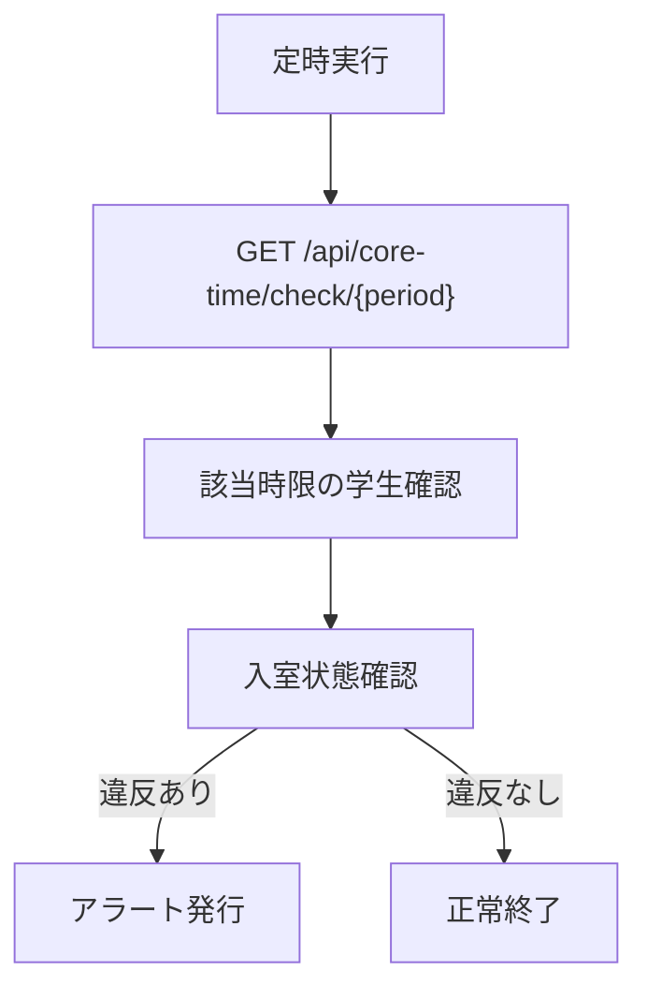

# AttendanceManager

## 概要
	学生の実習室の入退室の状況を管理するためのシステムです。
	学生証をFelicaリーダーで読み込み、サーバーにデータを送信して管理します。
	現在の利用状況や最近の利用状況のレポートを作成することができます。

## システム構成

### バックエンド
	- **FastAPI**: 高速なPython製WebフレームワークでRESTful APIを提供
	- **SQLite**: 軽量で高性能なデータベース
	- **JavaScript**: フロントエンドの実装

### フロントエンド
	- HTML/CSS/JavaScript
	- モダンなUIライブラリ（予定）

## システムアーキテクチャ

### データベース構造
```sql
-- 学生情報テーブル
CREATE TABLE students (
	student_id TEXT PRIMARY KEY,
	name TEXT NOT NULL,
	core_time_1_day INTEGER DEFAULT 0,  -- 1:月曜 2:火曜 ... 7:日曜
	core_time_1_period INTEGER DEFAULT 0,  -- 1:1限 2:2限 ... 6:6限
	core_time_2_day INTEGER DEFAULT 0,
	core_time_2_period INTEGER DEFAULT 0,
	core_time_violations INTEGER DEFAULT 0,
);

コアタイムは登録が間に合わないかもしれないので、
初期値を0とする.

-- 入退室記録テーブル
CREATE TABLE attendance_logs (
	id INTEGER PRIMARY KEY AUTOINCREMENT,
	student_id TEXT,
	entry_time DATETIME,
	exit_time DATETIME,
	FOREIGN KEY (student_id) REFERENCES students(student_id)
);

-- 現在の入室状況テーブル
CREATE TABLE current_status (
	student_id TEXT PRIMARY KEY,
	entry_time DATETIME,
	FOREIGN KEY (student_id) REFERENCES students(student_id)
);

-- アラート記録テーブル
CREATE TABLE alerts (
	id INTEGER PRIMARY KEY AUTOINCREMENT,
	student_id TEXT,
	alert_date DATE,
	alert_type TEXT,
	FOREIGN KEY (student_id) REFERENCES students(student_id)
);
```

## API エンドポイント

### 入退室管理 API


### コアタイム監視 API


## エンドポイント一覧

### 入退室管理
	- `POST /api/attendance`
		- 学生の入退室を記録
	- `GET /api/attendance/{student_id}`
		- 特定学生の入退室履歴を取得
	- `GET /api/current-status`
		- 現在の入室状況を取得

### 学生管理
	- `GET /api/students`
		- 登録済み学生一覧を取得
	- `POST /api/students`
		- 新規学生を登録
	- `PUT /api/students/{student_id}`
		- 学生情報を更新

### コアタイム管理
	- `GET /api/core-time/check/{period}`
		- 指定時限のコアタイムチェック
	- `GET /api/core-time/violations`
		- コアタイム違反履歴の取得

## セットアップ方法

1. リポジトリのクローン
```bash
git clone https://github.com/yourusername/AttendanceManager.git
cd AttendanceManager
```

2. サーバーの起動
```bash
cd server
pip install -r requirements.txt
uvicorn main:app --reload
```

3. クライアント（端末）のセットアップ
```bash
cd client
pip install -r requirements.txt
python AttendanceManager.py
```

## 開発環境
	- Python 3.9+
	- FastAPI
	- SQLite3
	- Node.js 16+
	- Docker

## ライセンス
MIT License
