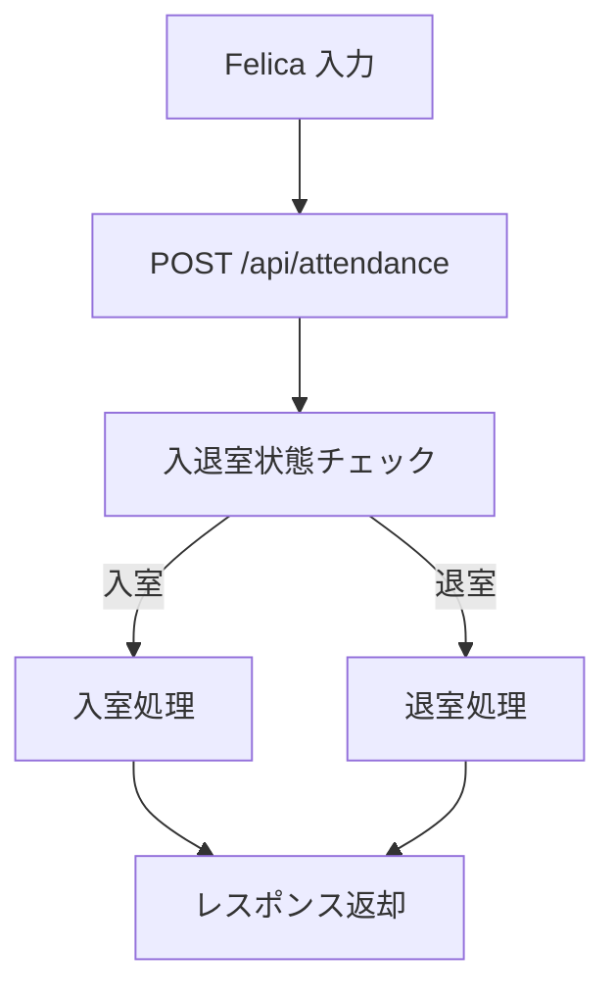
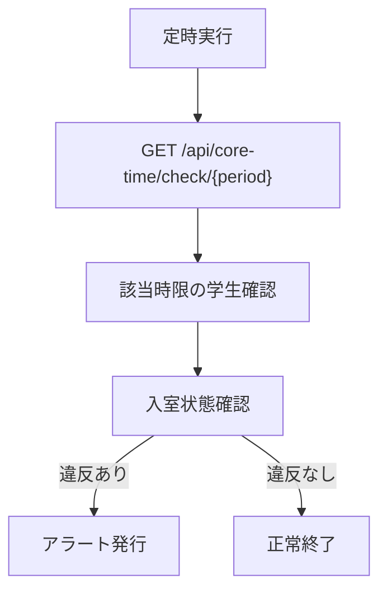

# AttendanceManager

## 概要
	学生の実習室の入退室の状況を管理するためのシステムです。
	学生証をFelicaリーダーで読み込み、サーバーにデータを送信して管理します。
	現在の利用状況や最近の利用状況のレポートを作成することができます。

## システム構成

### バックエンド
	- **FastAPI**: 高速なPython製WebフレームワークでRESTful APIを提供
	- **SQLite**: 軽量で高性能なデータベース
	- **JavaScript**: フロントエンドの実装

### フロントエンド
	- HTML/CSS/JavaScript
	- モダンなUIライブラリ（予定）

## システムアーキテクチャ

### データベース構造
```sql
-- 学生情報テーブル
CREATE TABLE students (
	student_id TEXT PRIMARY KEY,
	name TEXT NOT NULL,
	core_time_1_day INTEGER DEFAULT 0,  -- 1:月曜 2:火曜 ... 7:日曜
	core_time_1_period INTEGER DEFAULT 0,  -- 1:1限 2:2限 ... 6:6限
	core_time_2_day INTEGER DEFAULT 0,
	core_time_2_period INTEGER DEFAULT 0,
	core_time_violations INTEGER DEFAULT 0,
);

コアタイムは登録が間に合わないかもしれないので、
初期値を0とする.

-- 入退室記録テーブル
CREATE TABLE attendance_logs (
	id INTEGER PRIMARY KEY AUTOINCREMENT,
	student_id TEXT,
	entry_time DATETIME,
	exit_time DATETIME,
	FOREIGN KEY (student_id) REFERENCES students(student_id)
);

-- 現在の入室状況テーブル
CREATE TABLE current_status (
	student_id TEXT PRIMARY KEY,
	entry_time DATETIME,
	FOREIGN KEY (student_id) REFERENCES students(student_id)
);

-- アラート記録テーブル
CREATE TABLE alerts (
	id INTEGER PRIMARY KEY AUTOINCREMENT,
	student_id TEXT,
	alert_date DATE,
	alert_type TEXT,
	FOREIGN KEY (student_id) REFERENCES students(student_id)
);
```

## API エンドポイント

### 入退室管理 API


### コアタイム監視 API


## エンドポイント一覧

### 学生管理API
- `POST /api/students/`
  - 入力：
    ```json
    {
      "student_id": "学籍番号",
      "name": "学生名",
      "core_time_1_day": "コアタイム1の曜日（1-7）",
      "core_time_1_period": "コアタイム1の時限（1-6）",
      "core_time_2_day": "コアタイム2の曜日（1-7）",
      "core_time_2_period": "コアタイム2の時限（1-6）"
    }
    ```
  - 出力：登録された学生情報

- `GET /api/students/`
  - 入力：
    - `skip`: スキップするレコード数（デフォルト: 0）
    - `limit`: 取得する最大レコード数（デフォルト: 100）
  - 出力：学生一覧

- `GET /api/students/{student_id}`
  - 入力：
    - `student_id`: 学籍番号
  - 出力：指定された学生の情報

### 入退室管理API
- `POST /api/attendance/`
  - 入力：
    ```json
    {
      "student_id": "学籍番号",
      "time": "日時（ISO 8601形式）"
    }
    ```
  - 出力：
    ```json
    {
      "name": "学生名",
      "status": "入室" または "退室"
    }
    ```

- `POST /api/attendance-now/{student_id}`
  - 入力：
    - URLパラメータ: `student_id`（学籍番号）
  - 出力：
    ```json
    {
      "name": "学生名",
      "status": "入室" または "退室"
    }
    ```
  - 説明：現在時刻を使用して入退室を記録します。timeパラメータの指定は不要です。

- `GET /api/attendance/{student_id}`
  - 入力：
    - `student_id`: 学籍番号
    - `days`: 取得する日数（デフォルト: 0）
      - 0: 全てのレコードを取得
      - 1以上: 現在時刻から指定された日数分前までのレコードを取得
  - 出力：出席記録のリスト（入室時刻の降順）
    ```json
    [
      {
        "id": "レコードID",
        "student_id": "学籍番号",
        "entry_time": "入室時刻",
        "exit_time": "退室時刻"
      }
    ]
    ```

- `GET /api/current-status/`
  - 入力：なし
  - 出力：現在入室中の学生のリスト
    ```json
    [
      {
        "student_id": "学籍番号",
        "entry_time": "入室時刻"
      }
    ]
    ```

### コアタイム管理API
- `GET /api/core-time/check/{period}`
  - 入力：
    - `period`: 時限（1-6）
  - 出力：
    ```json
    {
      "violations": ["コアタイム違反した学生の学籍番号リスト"]
    }
    ```

- `GET /api/core-time/violations`
  - 入力：なし
  - 出力：コアタイム違反のアラート一覧
    ```json
    [
      {
        "id": "アラートID",
        "student_id": "学籍番号",
        "alert_date": "違反日",
        "alert_type": "core_time_violation"
      }
    ]
    ```

## セットアップ方法

1. リポジトリのクローン
```bash
git clone https://github.com/yourusername/AttendanceManager.git
cd AttendanceManager
```

2. Docker環境のセットアップ
```bash
# Dockerイメージのビルドと起動
docker-compose up -d

# APIサーバーが http://localhost:8889 で起動します
```

3. APIの動作確認
- Swagger UI: http://localhost:8889/docs
- ReDoc: http://localhost:8889/redoc

## 基本的な使用方法

1. 学生の登録
```bash
curl -X POST "http://localhost:8889/api/students/" \
  -H "Content-Type: application/json" \
  -d '{
    "student_id": "001",
    "name": "テスト太郎",
    "core_time_1_day": 1,
    "core_time_1_period": 2,
    "core_time_2_day": 3,
    "core_time_2_period": 4
  }'
```

2. 入室処理
```bash
curl -X POST "http://localhost:8889/api/attendance/" \
  -H "Content-Type: application/json" \
  -d '{
    "student_id": "001",
    "time": "2024-04-08T09:00:00"
  }'
```

3. 退室処理
```bash
curl -X POST "http://localhost:8889/api/attendance/" \
  -H "Content-Type: application/json" \
  -d '{
    "student_id": "001",
    "time": "2024-04-08T17:00:00"
  }'
```

4. 出席履歴の確認
```bash
curl "http://localhost:8889/api/attendance/001"
```

## 開発環境

- Python 3.8+
- FastAPI
- SQLite3
- Docker
- Docker Compose

## ライセンス

このプロジェクトはMITライセンスの下で公開されています。詳細は[LICENSE](LICENSE)ファイルを参照してください。
